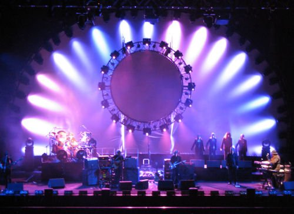

Title: Shine On You Crazy Prasoklokan
Date: 2008-03-04 13:46:00
Tags: ušima, zážitky

Tak je [to](http://honzajavorek.cz/blog/the-australian-pink-floyd-show-v-ostrave) za mnou. Jaký byl nedělní koncert The Australian Pink Floyd Show? Těžko říct. Některé věci nelze popsat slovy :) . A pocity?

## Numb

Začněme tím, co bylo **trochu hořké**. Koncert byl skvělý a dokonalý do posledního detailu, ale malinko jeho atmosféru snižovalo samotné publikum. Je velká škoda, že jsem byl na koncertě v České republice, zemi kde nerozumí anglicky. Kde nerozumí tomu, co jejich milášci řeknou na pódiu, kde nehodlají zpívat s kapelou. A to ani křičet tak jednoduchá slova, jako „RUN, RUN, RUN“ ve skladbě *Run like hell* během přídavku. A možná je to také tím, že hudba Pink Floyd přitahuje z velké části čtyřicátníky a padesátníky, kteří na koncert přišli v kvádru a pevným přesvědčením, že projevit radost něčím více než je potlesk, by mohlo být společensky nepřípustné a možná by si potom museli narovnávat kravatu.

## Welcome to the…

Ale zpět k tomu *růžovému* :) . To bylo onen nedělní večer hlavní… Do Ostravy jsem cestoval Tourbusem, tři hodiny. Střídavě louskal bibli JavaScriptu a střídavě usínal. Na Ostravském ÚANu jsme se sešli s Michalem a započali dalekou výpravu směrem k ČEZ areně. Já se ani jednou nekoukl na mapu Ostravy, takže jsem spíše tipoval a tak nějak dohromady jsme se shodli na směru, kterým jít. V cestě nám stálo několik ruin Ostravských chrámů z doby železné, takže jsme se kochali pohledy na práci rzi a eroze. Zbylo nám dost času a zdálo se, že k Vítkovické hokejové svatyni se blížíme na dohled, tak jsme srazili časovou prodlevu jedním pivem a poté se skrz deštivou tmu vydali **vstříc oranžovému nápisu ČEZ**.

## So Ya… thought ya… might like to go to the show…

Kolem haly se hemžilo dost lidí, ale nebyl problém se do ní dostat. Problémem byla spíše jen určitá kumulační místa. Exkurze na záchod se tak například proměňovaly v doslova válečné výpravy. Australští Floydi **začali stylově** – do závěrečné a úvodní harmonikové melodie z The Wall začaly burácet kytary a halou proletěl geniální song *In the Flesh?*. V **The Wall** potom pokračovali až po *we don't need no education*, od níž se vydali po cestě největších hitů. Myslím, že převažovaly skladby z **The Dark Side of the Moon** a **Division Bell**.

## Kangaroos on the wing

The Australian Pink Floyd Show nezapře svůj původ a nenechá diváka zapomenout, že **oni Pink Floyd jednoduše nejsou a být nemohou**. Obaly alb a různé vizualizace jsou stylizovány do náznaků Austrálie nebo **klokanů**. Rádio před *Wish You Were Here* nebo obal se čtveřicí živlů a mechanickou podanou rukou jasně odkazuje na Austrálii (živly jsou z rozžhavené přírody tohoto kontinentu a místo rukou je vyobrazen mechanický klokan). Vlastní identitu pak podtrhává obrovský nafukovací **prasoklokan**, který se objeví během *One Of These Days* místo obligátního prasete.

## Echoes

Jaké to bylo? Úžasné. Byl to pekelně drahý výlet, docela drahý lístek, celý víkend pršelo a vůbec bylo nevlídně a cestou zpět jsem čekal dvě hodiny na Ostravském autobusovém nádraží. Ale celé se to sakra vyplatilo :) . Geinální, dokonalé, perfektní, nezapomenutelné. Zpívali a hráli vážně jako Pink Floyd. **Nádherné.**

Ještě něco. Když jsem jednou viděl na YT video Waterse, jak zpívá *Time* (které normálně zpívá Gilmour), bál jsem se, že od klokanů mi to bude znít taky divně. Ale opravdu překvapili – měli jednoho Waterse a dokonce dva Gilmoury :D . Hlasová podobnost úžasná. Zjistil jsem navíc, že některé skladby vyniknou naživo. Sóla a výkony zpěváků, kytaristů… Nemluvě ani o **famózním výkonu zpěvaček**, když hráli *The Great Gig in the Sky*. Asi neopakovatelný zážitek.

Pokud bych měl možnost, určitě bych na ně zajel či zašel znova. Opravdoví Pink Floyd už jsou dědečci. Live 8, kde hráli poprvé od oddělení Waterse a zřejmě naposledy v historii společně, byla zřejmě **tečka za jejich neskutečnou hudbou**, která změnila svět. Zřejmě nezbývá než se spokojit s jejich více než kvalitní náhradou a vychutnávat si Australany, kteří stejně jako Pink Floyd umí neuskutečnitelné – zahrát své skladby živě tak precizně, jako ve
studiu.

Australané nakonec zahráli *Comfortably Numb*, stejně [jako to udělali Pink Floyd na Live 8](http://www.youtube.com/watch?v=0wtiNzci1Wc). A stejně jako to dělávali borci z Cambridge, dali jako přídavek *Run Like Hell*, s očitrhajícími světelnými efekty, přesně synchronizovanými s hudbou :) . A pak **konec**.

Ticho.

## Související

-   [Revivaloví Pink Floyd uspěli v Ostrave](http://www.denik.cz/hudba/floyd_ostrava_20080303.html)
-   [Australané v Ostravě oživili ducha Pink Floyd](http://www.novinky.cz/clanek/134479-australane-v-ostrave-ozivili-ducha-pink-floyd.html)
-   [Pink Floyd a Bohemians v Ostravě](http://musicserver.cz/clanek/21579/Australian-Pink-Floyd-CEZ-Arena-Ostrava-2-3-2008/)

Fotky z článku jsou z [http://www.aussiefloyd.com/](http://www.aussiefloyd.com/) a nechtělo se mi je zmenšovat. Pokud víte kde, koukněte na moje fotky :) . **AKTUALIZOVÁNO:** Na přání jsem dohledal [prasoklokana](http://www.aussiefloyd.com/cgi-bin/emAlbum.cgi?c=show_image;p=London%20RAH%2006;i=12;in=London%20RAH%2006%20-%2013.jpg).