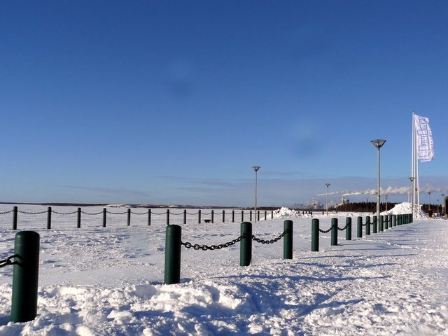
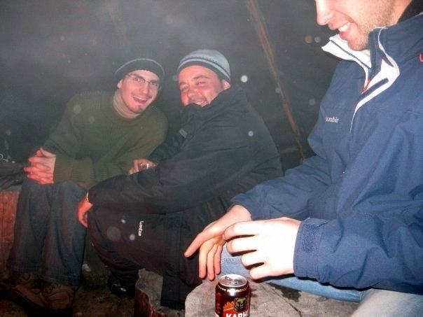

Title: Laponsko
Date: 2009-04-18 08:18:00
Tags: erasmus, finsko, zážitky

Co je Laponsko? Opět si pomůžu univerzální babkou vševědkou – pošlu
vás na [Wikipedii](http://cs.wikipedia.org/wiki/Laponsko) a pokud
umíte anglicky, jděte raději na
[anglickou](http://en.wikipedia.org/wiki/Sápmi_(area)). Je potřeba,
abyste si uvědomili, že Laponsko (Sápmi) je
**území na severu Skandinávie, jež nebere ohled na území států a rozkládá se od Norska přes Švédsko a Finsko až do Ruska**.
Jeho hlavním městem je **Rovaniemi** a má i svou vlajku. V Laponsku
žijí Laponci – **Sámové**, hovořící svými **vlastními jazyky**.
Těch je devět, jsou příbuzné Finštině, ale možná bližší Maďarštině.
Finové jim nerozumí. Sápmi má dokonce
[svůj fotbalový tým](http://en.wikipedia.org/wiki/Sápmi_national_football_team).
Nejvíce Sámů žije v Norsku a původ v tomto etniku má např.
i [Renee Zellweger](http://en.wikipedia.org/wiki/Sami_people).
**Sámové v pestrých krojích, příroda, sobi, polární záře. To je Laponsko.**

„Laponsko“ se ale také nazývá region severního Finska. Je
nejsevernější, největší (100 000 km^2^, pro představu – celá ČR má
80 000) a nejřídčeji osídlený. Největšími městy jsou hlavní město
**Rovaniemi**, které se nachází na polárním kruhu, **Kemi** se
sněhovým hradem a **Tornio** na hranicích se Švédskem, kde se vaří
zlato Laponska, pivo *Lapin Kulta*. Jediná dvě další města jsou
**Sodankylä a Kemijärvi**. Takže si představte zemi větší než ČR,
kde je jen pět měst a největší z nich má počet obyvatel jako
Karviná ;) . No a do této země jsem se vydal s osmi dalšími lidmi
na třídenní výlet. Zajet si jen tak do celkem komerčního Rovaniemi
ale prý není to pravé Laponsko, tak jsme se rozhodli jet
[daleko na sever, k Inari](http://maps.google.com/maps?f=q&source=s_q&hl=cs&geocode=&q=Inari,+Finsko&sll=68.903097,27.026367&sspn=4.1971,18.874512&ie=UTF8&ll=68.982046,27.026367&spn=1.994404,9.437256&t=h&z=7&iwloc=A).

## Den první, Kemi

V devíti lidech jsme pronajali auto a cestu jsme začali během
úterního dopoledne. Posádka byla složena z řidiče Narcisa, jeho
bratra, dvou kamarádů, Carmen, Rocío, Marty, Karoliny a mě. Jelikož
kompletně galicijská posádka neměla problém domluvit se
s Portugalkou Martou, byli jsme na výletě s Karolinou z Polska sami
dva anglicky hovořící. Oba jsme španělsky **vesměs rozuměli**, ale
hlavně pro mě to bylo dost obtížné, protože mluvili velmi rychle a
někdy i dialektem. Nechytal jsem se. Úchylné „ušišlané
portugalštině“ Marty jsem nerozuměl už vůbec. Zprvu to tedy byla
sranda, ale časem se mi to
**dost zprotivilo a docela mi ta španělština lezla krkem**. Na
druhou stranu musím říct, že tendence s námi mluvit anglicky byly,
ale protože Diegové (Narcisův bratr a jeden z kamarádů) anglicky
neuměli, nešlo to. Bylo lepší, aby dva lidi rozuměli trochu, než
aby jiní dva nerozuměli nic.

První zastávka byla v **Kemi**. Celá posádka se vydala do sněžného
hradu, kde já už jsem byl. Odpojil jsem se a
**prošel jsem si město**. Není nic extra, ve Finsku se mu prý říká
nejškaredší město. Mě nijak extra škaredé zrovna nepřišlo, ale to
asi proto, že jsem viděl už leccos :) . V Lidlu jsem nakoupil
nějaké dobroty a procházel jsem se na mraze tak dlouho, než moje
hispánská *crew* dorazila zpět k autu. Pak už jsme jeli jen stále
dál a dál na sever. Rovaniemi s polárním kruhem jsme projeli jakoby
nic a hurá do nekonečných horizontů pravého obrovského Laponska.

Kdo mluvil španělsky a komu jsem velmi dobře rozuměl, byla
**navigace v autě**. Když jsme byli uprostřed noci daleko na sever
za Inari, v místě, kde před námi byla nekonečná silnice daleko do
tmy, za námi stejně tak a vlevo i vpravo byl hustý jehličnatý les,
řekla „Zahněte doprava a jste na místě“. Nicméně nakonec jsme nějak
dojeli, hodná paní z penzionku nás donavigovala telefonem a vše
dopadlo dobře :) . Po tak dlouhé cestě (i se zastávkou v Kemi asi
12 hodin) jsme byli unavení, tak jsme se jen vybalili a moc už toho
nepodnikali. S kluky a Karolinou jsme ale nakonec přece jen šli
ještě ven. Koukali jsme na **hvězdy**, užívali si **ticho**,
**blbnuli v nekonečném sněhu** a rozjímali nad úžasnou
**přírodou**.

## Den druhý, Kaamanen (Jokitörmä)

Já mám tenhle obrázek prostě rád:

Asi jej nemusím moc popisovat. Naše destinace se nachází daleko za
polárním kruhem. Když vidíte podle dopravních cedulí, že jste
300–400 km daleko od míst jako Nordkapp nebo Murmansk, je to
zvláštní pocit. Kaamanen je
**severněji než celý Island, část Grónska, severněji než prakticky celá Kanada a Aljaška**.
A když se tak na tu Skandinávii dívám, říkám si… nebýt toho
**Golfského proudu**, nevím nevím…

Kolem poledne jsme se se zapůjčeným náčiním vydali
**lovit ryby na řeku**. Vyvrtali jsme do zamrzlé řeky několik děr,
ale nebylo to pořád ono, tak jsme šli dál a dál, až jsme se dostali
na obrovské zamrzlé jezero – **Vastusjärvi**. Tam se Carmen v jedné
z děr podařilo jednu rybku chytit :) . Užívali jsme si pěkného
počasí, fotili, dýchali čerstvý zmrzlý vzduch. S Alexem a Narcisem
jsem se vydal napříč jezerem k jednomu z blízkých kopečků.

Brzy jsme se vzdálili tak, že jsme nebyli na dohled. Na kopečku byl
hodně **hluboký sníh**, tak jsme si v něm zablbnuli a pak se
vrátili zpět na jezero. Ještě chvíli jsme tam dělali kraviny a
potom už jsme se opravdu začali pomalu vracet. Zatímco jsme se
klouzali po nezasněžených kouscích ledového krunýře jezerní
hladiny, zhoršilo se počasí a velmi snížila viditelnost. Podle
vlastních stop jsme došli zpět k ústí řeky a pak až do kempu. Po
cestě jsme dokonce našli jednu **venkovní saunu**, ale bohužel
nepatřila k našemu penzionu, tak jsme ji nemohli použít. Vrátili
jsme se akorát v pět hodin, kdy měli přivést **sněžný skútr** na
vyzkoušení. Pro všech devět lidí to vyšlo dohromady na 50 €, což
byla krásná cena, zajezdili jsme si chvilku na střídačku všichni a
pak už jsme se pakovali domů, na večeři.

V noci jsme ještě vykoukli ven, jestli neuvidíme **polární záři**.
Viděli jsme (potvrzeno místními), ale jen velmi slabou, spíš takový
„opar“. Ono na ty velké a barevné musí mít člověk opravdu super
štěstí… Den jsme zakončili u ohýnku v **kota**, laponském týpí.

## Den třetí, Rovaniemi (Santa Claus)

Ráno jsme se rychle posbírali a hurá zpátky. Teda hurá moc ne,
v Laponsku bylo krásně a zpátky se nám nechtělo. Ale udržovali jsme
si veselou náladu.

„Na kafe“ jsme se zastavili na pumpě v Sodankylä, ale jediná
opravdová zastávka nás čekala až v Rovaniemi, ve
[vesničce Santa Clause](http://en.wikipedia.org/wiki/Santa_Claus_Village).
Ať už *Santa Claus*, *Joulupukki* nebo *Papá Noel*, prostě se jedná
o toho
[chlapíka, co nosí dárky dětem na vánoce v kultuře západní Evropy](http://en.wikipedia.org/wiki/Father_Christmas).
Kromě Finska i docela hodně dalších evropských zemí věří, že Santa
Claus bydlí na polárním kruhu (v Americe spíš věří tomu, že bydlí
na severním pólu). Já nevěřím ani v samotného Santa Clause, páč mám
Ježíška, takže mě to moc netankovalo.
**Vesnička mi přišla dost komerční a velmi drahá** a že bych z ní
byl přeúžasně nadšen se říct asi nedalo. Nejvíce se mi líbila pošta
Santa Clause. Tato reálná pobočka Finské pošty načančaná do
vánočního hávu se zdála nejméně „umělohmotná“. Dokonce měla dvě
schránky – *today* a *Christmas*. Pokud hodíte poštu do druhé,
**přijde až před příštími Vánoci**. Taky můžete napsat dopis
Santovi a poslat ho právě na tuto poštu. Mají tam přihrádky se
spoustou dopisů z různých zemí, které jim chodí.

Na Santově vesničce se mi nejvíce líbil pocit toho, že jsem
**na polárním kruhu**. Užíval jsem si to mnohem více než přítomnost
umělohmotných sněhuláků a tlusťocha v červených hadrech. Až zavřeli
i ten poslední obchod se suvenýry a slunce téměř zapadlo, nezbylo
než nasednout zpět do auta a rozjet to směr Otokylä. Čekalo nás do
Oulu ještě **nějakých pár set kilometrů**.

## Lapland The Movie

Kromě spousty fotek jsem si přivezl i nějaká ta videa. Pospojoval
jsem je ve vysoce oceňovaném **patnáctiminutovém filmu** o několika
epizodách. Na [YouTube](http://www.youtube.com/user/KaniiniLM) ale
nelze nahrávat delší jak desetiminutová videa, takže jsem jej
nakonec stejně
[nahrál po jednotlivých dílech](http://www.youtube.com/view_play_list?p=D60FA75FFB9220F0).
Přeji příjemnou zábavu.

Video jsem udělal v programu
[VirtualDub](http://www.virtualdub.org/), který je **zdarma**, ale
pro běžného smrtelníka poměrně „geekovským“, zdlouhavým a náročným
způsobem. Pokud chcete udělat podobný „film“, studujte IT a naučte
se s VirtualDubem, nebo si **kupte** něco lepšího (pochybuju, že
lepší programy na úpravu videa jsou zdarma).

## Odkazy

-   [LumiLinna](http://www.snowcastle.net/en/), nějvětší sněhový
    hrad na světě, **Kemi**
-   [Jokitörmä](http://www.jokitorma.net/en/), kemp s penzionem,
    kde jsme bydleli v **Kameenen**
-   [Santa's Village](http://www.santaclausvillage.info/eng/village.htm),
    vesnička Santa Clause, **Rovaniemi**