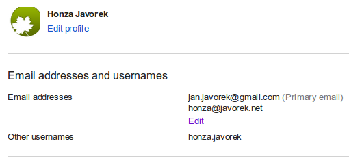

Title: Nový e-mail
Date: 2012-06-03 21:07:27

Dělám postupný *re-branding* svého internetového alter ega. Začalo to tím, že jsem se zbavil přezdívky *littlemaple* a všude kde to šlo jsem změnil své uživatelské jméno na *honzajavorek*. Překvapilo mě, že to většina webů velmi ztěžuje nebo vůbec neumožňuje.

Přemýšlel jsem, jestli nebude vhodné na různých službách sjednotit i takové ty "profilové informace" - no usoudil jsem, že to není špatný nápad, takže jsem většinou nikde kromě zcela základních dat nenechal vůbec nic. Takové "sjednocení" je totiž nejjednodušší na budoucí údržbu a poskytuje alespoň malinký, byť poměrně falešný pocit soukromí :-) Hodně účtů jsem v rámci čistky taky zrušil, nebo se o to snažil a vůbec byste nevěřili, u kolika z nich to vůbec nejde, což je teda podle mě mnohonásobně horší, než ta nemožnost se přejmenovat.

Většinu z uvedeného jsem udělal už před několika měsíci. Dnes jsem ale konečně smazal službu, která mi [pila krev už dlouho](http://honzajavorek.cz/blog/quo-vadis-google), a to Google+. Čekal jsem, až dodělám diplomku, protože jsem si nebyl jistý, zda pro její tvorbu ten účet nebudu potřebovat. Bohužel, ani na to mi nebylo plusko nijak užitečné. Dnes tedy letělo do koše. Zkusil jsem hned kliknout na sdílení fotek na Picase a hle - všechen bordel je pryč a můžu zase posílat jen krásné, obyčejné e-maily.

Koupil jsem doménu [honzajavorek.cz](http://honzajavorek.cz) a rozběhal na ní svůj blog. Starý web na [www.javorek.net](http://www.javorek.net) bude i se svým obsahem pomalu dožívat. Problém ale je, že mám na této staré doméně svůj hlavní e-mail - honza@javorek.net. Uvažoval jsem, jaký si vymyslet pro novou doménu, ale nic chytrého nebo vtipného, co by se dobře diktovalo do telefonu, mě nenapadlo. Řešil jsem to na Twitteru a mezi návrhy byly tuším me@honzajavorek.cz, jsem@honzajavorek.cz, ahoj@honzajavorek.cz, ja@honzajavorek.cz, email@honzajavorek.cz, a podobné. Žádné skvosty. Napadlo mě poprosit bráchu o zřízení adresy pod jeho doménou javorkovi.cz, ale kdyby si to někdo zadal do prohlížeče (jako to dělám u cizích adres často já), dostal by se na jeho poměrně osobní, potažmo rodinnou stránku, a ne na moji. A taky by se mu nesměl do budoucna narodit žádný Honzík, což jeden nemůže nikdy vyloučit :-D

Říkám si tedy, jestli se na takové šaškování nevykašlat a neuchýlit se po letech ke staré dobré generické adrese u e-mailového poskytovatele. Ono ani takové honzajavorek@email.cz není vůbec špatné. Je to konzistentní se všemi mými ostatními účty, slovo email je pro e-mailovou adresu dost neutrální a CZ jasně praví odkud jsem. Pro Čechy je navíc taková adresa poměrně zapamatovatelná.

Jenže když už měnit e-mail, tak aspoň vyřešit i něco, co mě trápí. Třeba Google Calendar nezvládá situaci, kdy mi někdo pošle pozvánku na jiný e-mail, než jan.javorek@gmail.com. Tvrdí mi potom, že nejsem příjemcem pozvánky a ať si jdu po svých. Musím pak všem vysvětlovat, že ač je můj hlavní e-mail tamten, v kalendáři ať používají jiný. Na jan.javorek@gmail.com mám taky jabber, Google Talk. Co je ale blbé? To, že začíná mým občanským jménem - Jan Javorek. Nechci, aby mi tak někdo říkal a nelíbí se mi ta adresa na pohled, mám rád písmeno H :-D

Sranda je, že honzajavorek@gmail.com mám jakoby zarezervované já, ale nemohu to používat. Všichni víme, že Google v adrese e-mailu ignoruje tečky, takže janjavorek je pro něj totéž jako jan.javorek a honzajavorek jako honza.javorek. Ostatně, totéž dělá v adresách uživatelských účtů i Facebook. No a kdysi kdesi jsem asi použil honza.javorek jako svoje alternativní uživatelské jméno. Tuším že na Picase. Google mi ji rezervoval jako *other username*.

Jenže problém je, že se k tomuto username nijak nedostanu. Nemůžu ho smazat, změnit, ani použít. Tedy nikdo si jej nemůže zaregistrovat, ale když někdo pošle e-mail na honza.javorek@gmail.com, nedojde mi! Což je nešťastné - tak málo by stačilo...

Na tomto místě si asi říkáte, že moje problémy byste chtěli mít. No, určitě nechtěli, protože vás nečeká těžká teoretická zkouška s kryptografie a nepíšete po večerech ze zoufalé prokrastinace články o naprostých hovadinách. Můžete se místo toho věnovat lepším věcem.

Takže jestli se vám mé osoby po tomto odstavci slitovalo, napište do komentáře, jak byste takové zapeklité e-mailové dilema řešili vy a jakých nevýhod či výhod jsem si nevšiml. Osobně to zatím vidím na návrat k jan.javorek@gmail.com. I když návrat je teda divné slovo, protože jako hlavní adresu jsem to nikdy nepoužíval.