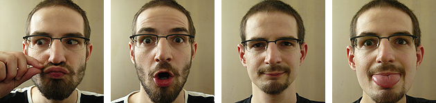

Title: Poslední hodiny před poslední zkouškou
Date: 2012-06-12 17:32:59

Pocit, který se opakuje už od prváku a v podstatě se na něm nic nemění. Je před každou těžkou zkouškou, kterou musím opravdu vydřít. Byl i před mou úplně poslední zkouškou z kryptografie.

Je to takový volný proud myšlenek, je to stav mysli, kdy se vám honí hlavou tisíc a jedna znalostí a přitom cítíte, že je ta vaše lebka úplně dutá. Myšlenky na základní potřeby z Maslowovy pyramidy jsou tím nejvznešenějším, co dokáže váš mozek vytvořit mimo studovanou látku. Přestáváte mít schopnost se soustředit na právě probíhající okamžik. Energiťáky nebo čaje a nedostatek spánku ve vás vzbuzují jakousi zvláštní euforii a nabuzenost energií. Nejraději byste začali tancovat. V dešti. Šibe vám. Povídáte si sami se sebou, zvláště v pokoji, kde nikdo jiný není. Zníte sám sobě jako duševně narušený, afektovaný šílenec. Blíží se osudová hodina a s ní nadšení, že už to bude za vámi, ale zděšení, že ještě neumíte vše podstatné.

Je to ten pocit, kdy se vzbudím po čtyřech hodinách spánku a

1. potřebuji ještě hodinu/den/týden/měsíc na to, abych to všechno uměl,
2. nebetyčně si přeji, aby to už bylo tady, abych to měl už za sebou, nechť to dopadne jakkoliv.

Z vnitřní hysterie se člověk posouvá do jakéhosi limba nihilistického fatalismu. Čas se přelévá z jedné nádoby do druhé, obrovskou rychlostí. Člověk vstane v sedm ráno a najednou je pět večer. Ať se po zkoušce uděje cokoliv, mysl to vždy vyobrazuje jako rajskou zahradu zalitou sluncem, samozřejmě se zpívajícími ptáčky. Ach... Budu se moci vyspat, začít normálně jíst, komunikovat s lidmi, holit se, otevřít si i jiné věci, než jen materiály k předmětu a papírové výpisky.

Výpisky! Ty jsou do chvíle CHÁ nejcennějším zdrojem poznání v galaxii. Jako talisman je vždy uchovávám v kapse, aby z nich alespoň cosi, snad osmózou, proniklo i přímo do mě při samotném aktu zkoušky. A po něm je z nich cár celulózy k vyhození - buď už nebude potřeba, nebo si stejně budu muset udělat tři jiné, abych se doučil mezery.

To mě přivádí na myšlenku, že ač jsem byl velkovýrobnou taháků na gymnáziu, za celé studium na vysoké škole jsem žádné nepoužíval, bojoval jsem čestně.

A nikdy mě neužilo na čtení správných řešení hned při příchodu domů. Zbytečné nervy, hodnocení stejně často nekoresponduje s výkonem a byla-li známka lepší než by asi měla, není nikomu radno pátrat, kde se tato disproporce vzala. Co je napsáno, to už nezměním. Už je vše dáno, už jsou vrženy kostky, vyloženy karty a překročen Rubikon.

Raději jsem vždy přiblblým, naivním úsměvem adoroval skutečnost, že minimálně několik dní nemusím už trávit v tunelu se stěnami popsanými rovnicemi, fakty, souvislostmi... Že mohu po záplavě dvaceti čajových tsunami a několika plechových energetických erupcích věnovat záchranářským pracem na mozkových buňkách a rekultivaci tělesné schránky.

Tak. A je to zaznamenáno. Snad už to nikdy nezažiju. Nikdy!