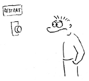
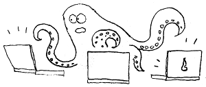
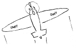

Title: Restart
Date: 2012-11-04 14:11:48
Status: draft

> Restart je dobrej a nutnej. Po každém restartu ale zustává fakt jeden, a to že ráno musíš vstát a něco dělat.

{: .right }Rozhodl jsem se přiblížit svým snům a vydat se za nějakým dobrodružstvím. Posunout se někam dál. Udělat změnu. Ke konci tohoto roku končím ve všech svých zaměstnáních a se všemi svými pracovními projekty. Nic domluveného nemám. Uvidím, co mi přijde do cesty.

Abych mohl 1. 1. 2013 vstát a něco dělat, vytvořil jsem si [tento životopis](http://honzajavorek.cz/cv). Pokud mi chcete pomoci, můžete na něj šířit odkazy.

## Sny

Jako odpověď na všechny otázky zde nastíním sny, které mě vedou ke změně.

### Nadšení

Chtěl bych mít práci, pro kterou se dokážu **nadchnout**. Něco z oboru, který je mi blízký (geografie, historie, koncerty, sport, cestování, ...?). Vím, že toto je běh na dlouhou trať a nejlépe jej vyřeším založením vlastního podnikání, ale chtěl bych se zatím alespoň přiblížit něčemu, pro co mi bude srdíčko tlouct svižněji. Bohužel, internetový marketing pro e-shopy to prostě není, ačkoliv poskytuje prostor pro tvorbu [velice zajímavých, netriviálních aplikací](http://www.mergado.cz).

### Práce z domova i odjinud

Poslední rok jsem více či méně pracoval způsobem *denně v kanceláři* a zjistil jsem, že to pro mne momentálně není efektivní. **Doma** nezažívám pocity osamělosti, jelikož tam mám spolubydlící. Nemám děti, takže se mohu zavřít v pokoji a klidně pracovat. Doma mám ledničku, sprchu, svou židli, svůj stůl, svůj oblíbený čaj. Nemusím to všechno nosit někam pryč do práce nebo dělat kompromisy. Doma se mi pracuje nejlépe. Nemám sice zrovna velkou disciplínu, ale nevím, proč bych ji měl řešit berličkami v podobě odjezdu do kanceláře, když je to jen o [cviku a vůli](http://www.osobniproduktivita.cz/2012/09/jak-nezvlcit-pri-homeoffice/). Chci svobodu v tom, jak si poskládám týden. Navíc pokukuji po tzv. [digitálním nomádství](http://navolnenoze.cz/blog/nomadi/), alesoň [příležitostném](http://navolnenoze.cz/blog/dovolena/).

<iframe src="http://www.slideshare.net/slideshow/embed_code/8424426" width="427" height="356" frameborder="0" marginwidth="0" marginheight="0" scrolling="no" style="border:1px solid #CCC;border-width:1px 1px 0;margin-bottom:5px" allowfullscreen> </iframe>

### Python

Přál bych si momentálně pracovat už jen a pouze v [Pythonu](http://python.cz). Asi se nebráním nějakému lehkému zasvěcování do jiných jazyků, jako jsou JavaScript, Erlang, apod., ale jádro mé práce by mělo být v **krocení modrožlutých hadů**. Chtěl bych se především už nadobro odlepit od PHP, přestat sledovat jeho vývoj a nemít potřebu se v něm nadále vzdělávat a nemuset udržovat žádný kód v něm napsaný.

### Není učení jako učení

V poslední době se to nějak sešlo a já cítím, že ještě nejsem v pozici, kdy bych měl někomu dělat **mentora**. Sám bych byl nejraději v roli toho, kdo se ještě nechává táhnout profesionalitou týmu a doučuje se nové techniky nebo nástroje. Už jsem to zažil v [Eventivalu](http://www.eventival.com) a chci ten posun zažít znova. Těžko se naučím testovat, když se k tomu mám donutit sám, ale mnohem rychleji překonám úvodní nedůvěru, pokud to dostanu nařízeno v rámci týmového workflow. Nejsem žádný nezkušený rybíz, ale pořád ještě chci být učen, ne učit a vysvětlovat. Alespoň prozatím.

### Zodpovědnost jen za sebe

Také jsem v tuto chvíli unavený z **vedoucích pozic**. Vést vývoj znamená zodpovídat za vše okolo projektu, dělat code reviews, řešit krizové situace, hlídat deployment, apod. Přináší to také nenahraditelnost či pocit nenahraditelnosti, což je akorát velký tlak a stres.

Neříkám, že mě to vyloženě nebaví, ale potřebuji si od toho odpočinout. Chci být zase chvíli truhlářem, který si zaleze do dílny a tam v klidu, tichu a při vůni dřeva vyrábí stůl. Ten nejlepší stůl, jaký umí. Jen občas přitom vyjde ven a konzultuje s ostatními jeho podobu, nebo se jej snaží prodat.

### Dobrodružství a změna

{: .right }V neposlední řadě hledám také **dobrodružství**. Ještě pořád si pamatuji to chvění, když jsem si šel ve Finsku poprvé do obchodu koupit těstoviny nebo poslat pohled a v trafice jsem platil kartou za poštovní známku. Pracuji od roku 2003 a mám před sebou ještě zhruba 40 let *férové hokny*. Sednout si na židli do kanceláře v nejbližší korporaci a čekat na dva týdny dovolené nebo na důchod je prostě to poslední, co chci teď ve svých 25 letech podniknout. Tím nechci být nijak zlý - ty firmy nemohou za to, že při pohledu na jejich loga se mi nezvedá hladina adrenalinu. Třeba z toho za pár let vyrostu a ještě rád se do nich vrátím. Ale teď se na to bohužel ještě necítím.

## Dejte mi šanci

Pomozte mi splnit mé sny. Předejte prosím [můj životopis](http://honzajavorek.cz/cv) kam nejdál můžete! Děkuji :)

<small>P.S.: Pokud by tam někam vedly [přímé lety z Brna](http://www.airport-brno.cz/index.php?id=15&lang=cs) nebo slušné vlaky, bylo by to úplně dokonalé ;)</small>
