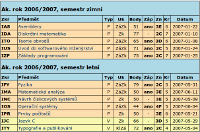
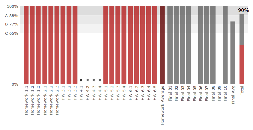
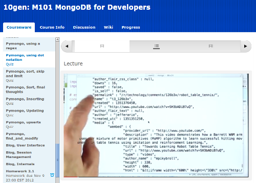
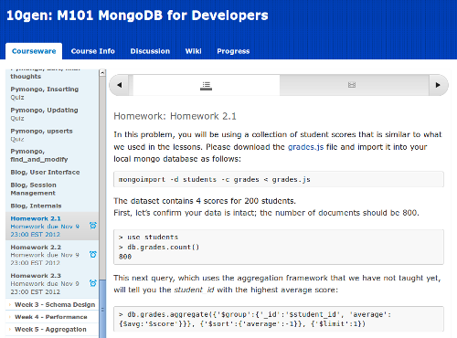

Title: Áčko od 10gen
Date: 2013-01-07 10:59:04

*Na úvodní vysvětlení: Dnes se na vysoké škole známkuje tak, že dostáváte písmenka od A do F, kde A odpovídá jedničce a F pětce. Nění to nějaký imperialistický výmysl, děje se tak myslím většinou kvůli kompatibilitě s ostatními evropskými a světovými školami - aby šlo přecházet a uznávat předměty.*

## Vysokoškolský lajdák

{: .left }Vysokou školu jsem studoval vždy dost **pragmaticky**. Neměl jsem kvůli práci čas na nějaké skvělé výsledky a navíc jsem již brzy dostal pocit, že můj průběžný zájem nebo vědomosti, které si odnáším, **neodpovídají výsledné známce**. Někdy jsem nemusel udělat skoro nic a prošel jsem, jindy mě látka bavila, učil jsem se, ale nebyl jsem ani tak schopen dosáhnout ničeho lepšího než Éčka. Příkladem budiž předmět [BMS](http://www.fit.vutbr.cz/study/courses/BMS/), jenž mě dost bavil, přestože fakt nemám rád sítě - dodnes si díky němu pamatuji spoustu zajímavostí o GPS, GSM, Wi-Fi, Bluetooth, policejních vysílačkách, satelitech, apod. Nicméně zkouška tam byla **velice detailní** a protože pro mě byl ten předmět spíš jen jakési *hobby*, nebyl jsem schopen ji ani napodruhé udělat. Dál jsem to nezkoušel, bylo to těsně před mým odchodem z FITu a tak zapracovala i motivace něco takového vůbec formálně dokončovat.

Zastával jsem názor, že **na výsledné známce nezáleží**. Dbal jsem pouze na svůj **osobní pocit**, jaký jsem si z toho kterého kursu odnesl. Neaspiroval jsem tedy nikdy na stipendium, spíše naopak. Za svá studia jsem Áčko dostal opravdu zřídkakdy a to jen tehdy, kdy jinou známku dostat snad ani nešlo. Byl to stav mysli, obrana proti jakési nespravedlnosti vůči mě či druhým ve vysokoškolském systému, takže i [Výstavbu překladačů](http://www.fit.vutbr.cz/study/courses/VYPe/) jsem ukončoval bídně, ač jsem tenkrát chodil do školy jen díky ní a snad i obědům. Opět, bylo to pro mne *hobby*, zájmová činnost, chodil jsem tam dobrovolně, ne kvůli kreditům. Zkoušku jsem dělal tak, aby mě nezatěžovala, jelikož jsem si sám dokázal ohodnotit, **zda mi předmět něco dal nebo ne** a zda jsem do něj chodil rád ze zájmu, nebo z povinnosti a strachu.

## Šprtem v 10gen

Minulý semestr jsem se přihlásil do [kursu společnosti 10gen](http://education.10gen.com/). To je firma, která stojí za databází [MongoDB](http://www.mongodb.org/) a v kursu šlo tedy o to si práci s ní osvojit. **Výuka probíhala online, zdarma.** Softwarový rámec pro kursy zajišťuje společnost [edX](https://edx.org), což je neziskovka řízená Harvardem a MIT. Jak napovídá titulek článku, dostal jsem nakonec Áčko a dokonce mi za něj nejspíš přijde poštou nějaké osvědčení. **Mám z něj radost a vážím si jej.**

Nabízí se otázka, proč si jej vážím víc, než dobrého výsledku na vysoké škole? Zkusím si odpovědět:

- Dělal jsem vše **dobrovolně** a z vlastní vůle. <small>Peníze zde nehrály roli, kurs je zadarmo.</small>
- Předmět mě **bavil**. Věnoval jsem se mu, protože **se stále připomínal** a nebylo extrémně obtížné ani nijak otravné v něm pokračovat. Naopak, byla by škoda nevytrvat, i když jsem zrovna neměl náladu.
- Vyhovoval mi **způsob výuky**. Videa, která si pustím kdy chci během celého týdne. Mohu je zastavovat, přehrávat znovu. Krátké kvízy na ověření, že jsem dával pozor. Úkoly. Na závěr zkouška, na kterou mám tolik času, kolik potřebuji (několik dní) a přesto není lehká.
- Jednotlivé lekce byly **přiměřeně dlouhé**, přesto velice názorné a objasňující. Lektor byl záživný.
- Ač nebyly úkoly nějak výrazně obtížné, bylo potřeba jim **věnovat čas a energii**. Pro naučení látky a udržení kontaktu s předmětem to však stačilo.
- **Nepřipadal jsem si jako nějaký zločinec**, který na základě presumpce viny podvádí a fláká se. Bylo se mnou jednáno jako s člověkem, nikdo ze mě *nedřel bodíky* v potu mé tváře. Týden s nejhoršími výsledky se automaticky škrtal z hodnocení, čehož jsem využil v době nemoci.
- Nakonec jsem byl **adekvátně ohodnocen známkou**. Nejlepší známku nebylo extrémně obtížné získat, ale ani nijak snadné. Kdybych měl o tři procenta méně, nemám ji.

## Forma výuky

Ještě než vám kurs vřele doporučím, podělím se o **několik dalších svých dojmů**.

- Byly vypsány dva kursy, jeden pro vývojáře (můj), druhý pro administrátory.
- Na začátku se přihlásilo 21 116 studentů. Kurs úspěšně dokončilo 3976 (19 %). Nějaké další statistiky jsou [na jejich blogu](http://ed-blog.10gen.com/post/38413879802/m101-completion-stats).
- Časový harmonogram kursu byl trochu nesystematický, protože to byl jeho první běh v historii a i 10gen se na něm učil jak to má vypadat. Také byl hurikán Sandy, kvůli kterému se výuka posunovala.
- Termíny na úkoly jsou velice přívětivé pro absolventa FITu jako jsem já. Nejen že v oku zamáčknete zkapalněnou nostalgii, když odpověď odešlete přesně ve 23:59, ono máte dokonce ještě několik hodin k dobru díky časovému posunu do USA! ;-)

Takto vypadala **běžná lekce**. Nikdy netrvala více jak několik minut, ale v jednom týdnu bylo lekcí poměrně dost.

Nejdříve video, potom **kvíz** (ten se nezapočítává do hodnocení, je pouze pro procvičení). Po kvízu je vždy ještě **krátké video s vysvětlením** správné odpovědi.

**Domácí úkoly** mívaly delší zadání. Hodnocení probíhalo nějakou smysluplnou odpovědí do formuláře, pokud šlo např. o analýzu nějakého datasetu, nebo jste zadali kód, který pracovní program vypsal, pokud bylo vaše řešení správné. Prý šlo snad občas i nějak podvádět, ale to jsem nikdy nezkoušel.

K tomu všemu bylo dostupné ještě **fórum, kde mohli studenti diskutovat** mezi sebou a odpovídat si na dotazy. Samozřejmě tam odpovídali i lektoři, aby rozřešili případné nejasnosti v zadání úkolů apod. Klikl jsem na něj však asi jen jednou, takže o tomto vám více nesdělím. Myslím, že 10gen dokonce poskytoval i nějaké **osobní konzultace**, pokud jste byli schopni přijít do jejich kanceláří.

## Na co čekáte?

Pokud vás může MongoDB byť jen teoreticky zajímat, [jděte do toho](https://education.10gen.com/courses/10gen/M101P/2013_Spring/about). Opravdu to doporučuji - ne vřele, ale přímo na <abbr title="jsem z kraje vysokých pecí">1 535</abbr>°C. Upřímně, MongoDB není nějaká hračka pro frikulíny, je to **věc, kterou jsem měl dostat do ruky před deseti lety** místo <small>[nefunkční](http://www.root.cz/clanky/co-nefunguje-v-mysql-jak-to-obejit/)</small> MySQL <small>[bez budoucnosti](http://www.root.cz/clanky/databaze-mariadb-valcuje-mysql/)</small>. Tím nechci nijak zpochybňovat místo pro SQL, ale MongoDB je prostě jiná, programátorsky přívětivá. Podle mě se hodí opravdu každému druhému, protože na většinu malých problémů bude nerelační přístup stejně dobrý jako relační, ale odháže vám spoustu zbytečných větví od noh. <small>No a když zateskníte po cizích klíčích, vždy je tu PostgreSQL.</small>

Na jaro 2013 jsou vypsány tři kursy:

- [M101P: MongoDB pro vývojáře](https://education.10gen.com/courses/10gen/M101P/2013_Spring/about)
- [M101J: MongoDB pro Java vývojáře](https://education.10gen.com/courses/10gen/M101J/2013_Spring/about)
- [M102: MongoDB pro databázové administrátory](https://education.10gen.com/courses/10gen/M102/2013_Spring/about)

<small>U slovního spojení *databázový administrátor* si prostě vždycky musím vzpomenout na [tento slajd](http://www.slideshare.net/spaze/why-not-orm/18) Michala Špačka.</small>

Tak hurá na to, **začíná se 21. ledna!**
