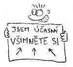
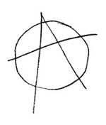

Title: Human Resource
Date: 2013-01-18 22:06:04

V listopadu a prosinci 2012 jsem si hledal nové zaměstnání. Pokud vás zajímají souvislosti, najdete je v předchozích článcích o mém [restartu](http://honzajavorek.cz/blog/restart) a o tom, [jak to nakonec dopadlo](http://honzajavorek.cz/blog/mezi-dvanactkou-a-trinactkou). Na trhu práce jsem bojoval s [poměrně nestandardním CV](http://honzajavorek.cz/cv). V následujících odstavcích se pokusím podělit o zkušenosti, které jsem během oněch dvou měsíců získal.

## Co se mi moc nepovedlo

Významný vliv na výsledek celého mého hledání měla skutečnost, že jsem vlastně nevěděl **co chtít konkrétně**. Měl jsem jasnou představu o tom **co nechci**, ale obraz oné samotné vysněné práce byl dost mlhavý. Měl jsem výčet vlastností, jež jsem po novém zaměstnání požadoval, ale nebyl dostatečně detailní na to, abych mohl hledat práci nějak lépe, než jen rozhazováním sítí do všech stran.

{: .right }Na to doplatilo i mé *vymazlené* CV. Nakonec se téměř vůbec **nesetkalo s tím správným publikem** a pro většinu návštěvníků bylo příliš rozvláčné. Byl jsem z toho potom tak rozladěný, že jsem jej pod nadpis "Pro lidské zdroje" zkrátil na čtyři věty a s textem "Pro lidská stvoření" jsem nechal odkaz na původní verzi. Zpětně bych rozdělil cílové skupiny svého webového životopisu asi následovně:

1. **Lidé jako vy**, vám rovni, ti ocení životopis *od srdíčka*, s nímž jste si dali velkou práci. Budou jej sdílet, lajkovat, retvítovat, budou si podle něj dělat to svoje příští CV, ale práci vám tito lidé nedají. Málokdy se jejich sdílení nějak projeví na výsledku, máte akorát větší publikum.
2. **Profesionální personalisté** (HR) se vámi příliš nezabývají, očekávají stručné informace v bodech. Jsou schopni se vás po týdnu komunikace zeptat i na jméno nebo odkud že vlastně jste. Jejich čas je drahý, proto minimalizují vše, co jim jej bere. Ať už vám říkají cokoliv, jste v tomto případě součástí velké mašinerie, fabriky na práci. Personalista ocení ještě tak LinkedIn profil, ale i ten je pro něj někdy moc *ukecaný* a raději se vás na ty tři věci, které jej opravdu zajímají, zeptá telefonicky.
3. Já hledal **osvíceného zaměstnavatele** v malé firmě, který nechce *opice* ani *prostě nějaké pracovníky*, ale záleží mu na každém členovi jeho týmu a má starost o to, aby si všichni správně padli do noty. Nehledá přes HR, vybírá si pečlivě sám. [Přímo chce](http://boring.synopsi.tv/job-opportunities/), aby ten váš životopis byl *od srdíčka* a pokud takový napíšete, ocení to. Dbá na vaše hodnoty, zajímá jej čemu věříte a co si myslíte.

Podle mě se CV dostalo k hromadě lidí z první kategorie, desítkám z druhé a jednotkám z té poslední. Jak jsem naznačil výše, **zásadní vadou byl způsob, jakým jsem se snažil jej šířit**. Začal jsem *střílet všude kolem sebe* s domněnkou, že se moje CV nějakým záhadným způsobem donese až k těm, jež bych tak rád oslovil. Sdílet jej na Twitteru nebylo nic špatného, ale měla to být až jakási doprovodná záležitost.

Když jsem neměl patřičnou odezvu, napadlo mě **projít zprávy na LinkedIn** a napsat všem, kteří mě za poslední rok otravovali s nějakými nabídkami. Tím jsem se předhodil do rukou všem různým personalistům, což vedlo k velice... řekněme... *intenzivnímu prožitku* celého mého hledání. Rozepíšu se o tom níže.

## Jak bych to udělal dnes?

{: .left }Na svou vlastní obranu musím říct (kromě známého rčení o bitvě a generálovi), že jsem celé své hledání nové práce původně bral spíše jen jako takový pokus. Věděl jsem, že v ČR nějakou práci najdu, ale lákalo mě **zkusit prorazit do zahraničí**. Vědel jsem, že nebude problém usadit se někde v kanceláři, ale co taková **práce na dálku**? Vypsal jsem si tedy na papír podmínky, jaké by měl mít můj *dream job* a na těch jsem pak stavěl i svůj životopis. Nemyslel jsem si, že to musí jednoznačně vyjít - právě naopak. Bylo to takové "Co kdyby?" a "Proč to nezkusit?" :-)

Když člověk testuje **samotnou průchodnost** nějaké věci, nedělá si konkrétní představy. Nevěděl jsem do jakého státu chci nebo pro jakých deset londýnských firem bych chtěl pracovat, abych jim napsal e-maily a tím hledání odstartoval. Dnes už vím, že leccos průchodné je a kdybych hledal znova, udělám to jinak:

- Vyberu si jednu, možná dvě **destinace** (města, ne státy), kam chci. Dopravní spojení s tímto místem mi nesmí být proti srsti, stejně tak kultura, jazyk, apod.
- Strávil bych hromady času zjišťováním jaké firmy odpovídající mým požadavkům tam jsou, jaké mají pracovní podmínky, apod. Vytvořil bych si **seznam vysněných potenciálních zaměstnavatelů**.
- Jasně bych si vymezil **způsob kontraktu** (ŽL nebo klasická zaměstnanecká smlouva). Sehnal bych si informace o tamějších daních nebo věcech, které pro mne plynou jako pro podnikatele, když s danou zemí podnikám (např. povinné DPH).
- Psal bych **přímo zaměstnavatelům**, nejlépe nějakým CTO - s těmi se programátorovi dobře komunikuje, nehrají na lidi divadýlka, bývají to často spoluvlastníci. Zcela bych z procesu vynechal HR. Pokud vám jde o jiné hodnoty než peníze, nejsou užiteční ani jako vyjednavači.
- Šel bych s **jasně formulovanou vlastní nabídkou**, kde by bylo jasně napsáno kdo jsem, co chci, proč, čím mohu přispět a za jakých podmínek.

Třeba bych opět na něco narazil, ale to je přirozený proces učení a průzkumu terénu. Získal bych další zkušenosti, napsal nový článek na blog a příště bych na to šel zase jinak :-)

## Další poznatky

- Trh s prací v IT je v zahraničí **strašně pokřivený**. Pokud umíte něco víc než středoškolák, utrhnou vám ruce. **Poptávka je ohromná, nabídka malá**.
- **Dlouhé texty dnes nikdo nečte.** Nikdo. Ne, fakt nikdo a je úplně jedno, kolik jste si s nimi dali práce. Je doopravdy úplně jedno jak jsou důležité pro vás - nikoho prostě nezajímají (pokud nemají nějakou vlastní motivaci danou věc číst).
- **Vaše idály nikoho nezajímají.** Nikdo nepočítá s tím, že byste práci hledali pro uspokojení potřeb, které nelze vyčíslit penězi nebo kvantifikovat benefity. Můžete lidem opakovat do zblbnutí jak to myslíte, ale většina jich je prostě zaseklých na tom svém a snaží se vás přesvědčit materiálně. Moje teorie je, že mi lidé nevěří co říkám a jsou přesvědčeni, že je to jen póza a zástěrka. Že mi o to ve skutečnosti prostě nemůže jít.
- Pokud budete tak hodní a přesunete se do té materiální roviny, **s penězmi ani benefity žádný problém není**.
- **Je problém s prací na dálku.**
- Pokud nejste schopni volat si s HR nebo potenciálním zaměstnavatelem **anglicky přes telefon** či Skype, velice se vám snižují šance něco najít.
- Pokud jste **ochotni se přemístit** (*relocate*) a máte už nějaké zkušenosti, v podstatě lusknutím prstu můžete na západě sehnat práci. Londýn, Mnichov, Madrid, Seattle, Canada - cokoliv je libo.
- Kontrakt na ŽL se moc nenosí. Všechny nabídky, které jsem dostal, byly na **standardní pracovní poměr**. Samozřejmě že lze pracovat v zahraničí na *business license* kontrakt, ale zřejmě se to musí shánět přes jiné kanály. (Mě odchytly hlavně personální agentury, přímé nabídky práce jsem dostal v podstatě jen z ČR nebo SR.)
- [Práci na dálku](http://honzajavorek.cz/blog/prace-z-domova) seženete jen s **důvěrou**. Důvěru musíte někde získat. Nepočítejte s tím, že pokud nemáte nějaké perfektní mezinárodní reference na svou dlouholetou práci na dálku, seženete z fleku v zahraničí nějaký *telecommuting*. Největší ústupek, který vám udělají, bude možnost pracovat u nich v kanceláři třeba půl roku a když se osvědčíte, začnou vás pouštět na pár dní v týdnu domů. Cestou asi bude nejspíš [budování pověsti](http://bob.mcwhirter.org/blog/2010/09/12/HOWTO-work-from-home/) na open source nebo nějakých projektech na lokální scéně a postupně se propracovávat.
- Nevím jak je přesně definice toho slova *startup*, ale já si to vždy představoval jako [partu vousatých chlapíků](http://www.museumofhoaxes.com/photos/microsoft.html) v garáži, kteří prodali i boty, jen aby měli na hosting a doménu. Opravdu jsem nečekal, že **poletím na pohovor na otočku letadlem** a dostanu to bez mrknutí oka celé proplaceno.
- Některým státům přijde úplně v pořádku **danit lidem platy skoro 50 %**. Firma vám řekne číslo, vám spadne držka, ale že ho máte vydělit dvěma abyste se dostali na *netto*, to už se jen tak nedovíte.
- Některým státům přijde úplně v pořádku **udávat plat v částkách za rok**. Firma vám řekne číslo, vám spadne držka, ale že ho máte vydělit dvanácti...

## Personalisté

Největším **zklamáním**, které jsem během celého procesu hledání práce prožil, byla **spolupráce s HR**. Už dříve jsem měl na svém LinkedIn profilu tuhle větu:

> I am not human resource. I am human being.

Bral jsem to však spíše jako vtip. Dnes to beru zcela vážně jako svou filosofii. Já jsem upřímný, přímočarý člověk a nemám rád, když na mě někdo hraje všelijaká divadla, podbízí se mi a tvrdí mi, že je něco zelené, když je to červené, **jen aby dostal provizi**. Lidé z HR u mě nyní spadají do kategorie *splachovacích asertivních potvor*, podobně jako podomní prodejci nebo většina telemarketérů z callcenter.

- Personalista funguje **mechanicky**. Pokud se tváří, že mu na vás záleží, je to naučené.
- Protože je trh s prací v IT tak pokřivený, **strašně si vás nadbíhají**. Můžete si z nich klidně dělat srandu nebo je ponižovat, stejně s vámi budou jednat jako se zlatem. (Nezkoušel jsem to úplně natvrdo, ale měl jsem z toho takový pocit.)
- Můžete si do profilu napsat co chcete, nikoho to nezajímá. **Zajímá je pouze heslovitý seznam vašich atributů**, aby jej porovnali s podobným seznamem z inzerátu.
- Pokud personalista cítí, že je alespoň 10% šance, že se na pozici hodíte, bude **ohýbat vás i požadavky** tak dlouho, až budete vy i zaměstnavatel přesvědčeni, že se na to fakt hodíte a je to pro vás naprosto neopakovatelná příležitost.
- Pokud existuje **činnost, která nevede k provizi**, HR ji nedělá, byť by patřila k dobré morálce. Jestliže dojde k odmítnutí nabídky, neobtěžuje se personalista firmu vůbec o vašem rozhodnutí informovat - je to pro něj už jen ztráta času. Oni pak chudáci vůbec neví na čem jsou a vy nakonec vypadáte jako idiot.

Nejvíce ze všeho mě asi štval ten **posunutý žebříček hodnot**. Tím, že jsem neměl peníze na prvním místě a že jsem dbal na své představy o zaměstnání, které šly *od srdíčka*, stal jsem se pro personalisty nepochopitelným a nesrozumitelným. Podsunovali mi jejich chápání světa, ale to mě akorát frustrovalo, protože jsem nevěděl, jak jim mám své postoje vysvětlit. Psal jsem jim více textu který oni vůbec nechtěli číst a tím se to akorát kazilo víc a víc...

Připadal jsem si prostě, jako by mi někdo **dohazoval přítelkyni podle toho jestli je blond, má velká prsa a umí alespoň čtyři sexuální polohy**, přitom já si do podmínek jasně napsal, že je pro mě důležitá láska, vzájemné jiskření a společné vize.

Brácha na mou paralelu s dohazovačem hezky navázal:

> HR je taková seznamka. A platí ho firma, ne ty. Pokud bys ho platil ty, nejspíš by mu více záleželo na tom, aby naplnil tvé ideály, abys byl spokojen, aby se to povedlo. Ty bys o něm napsal, že je super a sám bys ho příště využil třeba zas. Platí ho však firma a ta má zcela jiné cíle. Ta sice může rozmýšlet trochu nad tvými ideály, ale v zásadě potřebuje někoho, kdo by pro ni udělal tu práci. Kdyby to nepotřebovala, tak nikoho nehledá. Některé budou přemýšlet nad tvými sny trochu, jiné méně. Tohle se ještě setře, když vložíš mezičlánek - seznamku. Motivace těch lidí zcela ničí jakoukoli možnost k tobě přistupovat jinak než k human resource. Mají zoufale málo času, potřebujií udat mnoho lidí. Provolají mraky peněz a snaží se udat alespoň někoho. Na IT trhu je obecně dost hlad po kvalitních lidech, takže poptávka převyšuje nabídku. Nemají kde ty lidi brát. Konkurence je vysoká (firmy si klidně mohou nakonec samy hledat přes LinkedIn a neplatí pak provizi). Nějaké ideály firem, že tahle HR agentura dodáva "kvalitní a prověřené lidi" už vzala na tomto poptávkou pokřiveném trhu dávno za své. Pokud by HR dnes řešili nějaké tvé idály, vůbec by si nevydělali na chleba.

Nemůžu to své setkání s HR ale zase hodnotit tak špatně, protože něco jsem se na tom určitě naučil. Například jsem se zbavil ostychu telefonovat anglicky.

## Nakonec nic

{: .right }Jak jsem psal už ve svém [novoročním článku](http://honzajavorek.cz/blog/mezi-dvanactkou-a-trinactkou), rozhodl jsem se nakonec zůstat na volné noze a dokonce ji ještě více rozvolnit. Nabídek jsem měl spoustu, prošel jsem si různými pohovory a námluvami, ale **vše jsem pak odmítl**. Uvědomil jsem si, že jsem chtěl původně vlastně **něco jiného** a že si svá přání mohu nejlépe splnit sám.

Svého hledání práce však **nelituji**. Vzalo mi to množství energie, ale mnohé jsem se naučil, poznal jak kde určité věci fungují, proletěl se letadlem, nabral zkušenosti, jaké se mi budou určitě jednou ještě hodit. Navíc je dost možné, že bez celého toho procesu, jenž jsem 1. 11. 2012 spustil, by mi třeba na přelomu roku ani nedošlo, že je zde pořád i varianta, kde se starám sám o sebe. Sice taková staronová varianta, ale vůbec nijak špatná :-)
